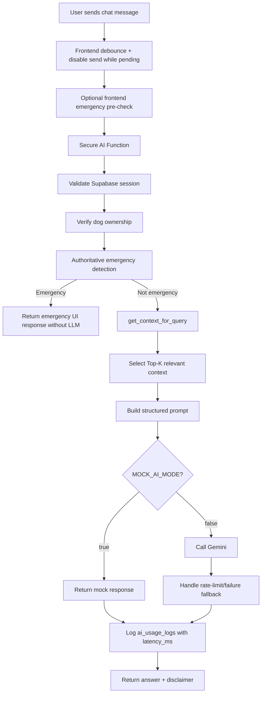

# DogCareAI – Architecture Document

## 1. Purpose

This document defines the technical architecture for DogCareAI Phase 2.

The goal is to translate the approved `SPEC.md` into a practical, zero-cost-oriented web application architecture before starting implementation with Codex.

This document must be read together with:

- `SPEC.md`
- `docs/ADR-001-stack-choice.md`
- `docs/ADR-002-ai-cost-control.md`
- `.env.example`

Implementation should not begin before the architecture, design, and agent instructions are clear.

---

## 2. Architecture Goals

DogCareAI must be built as a simple, maintainable, AI-assisted web application that demonstrates:

- Spec-driven development
- Clear separation between frontend, data, and AI services
- Context engineering for AI responses
- Safe API key handling
- Zero-cost MVP constraints
- A realistic path to beta by 19.05.2026

The architecture must avoid mandatory paid services, avoid unnecessary backend complexity, and keep beta implementation focused on the smallest useful flow.

---

## 3. Approved MVP Stack

### Frontend

- React
- Vite
- TailwindCSS
- React Router

### Backend / Backend-as-a-Service

- Supabase Authentication
- Supabase Postgres Database
- Supabase Row-Level Security
- Supabase Storage only if needed after the beta

### AI Layer

- Gemini API through a secure server-side boundary
- Mock AI mode for development, testing, and demos

### Server-Side Boundary for AI Calls

Preferred options:

1. Supabase Edge Function
2. Vercel/Netlify serverless function
3. Mock mode only, when a secure server-side function is unavailable

The Gemini API key must never be exposed in frontend code.

### Beta Storage Decision

For the beta deadline, dog profile images are not mandatory.

The beta should use one of the following simple alternatives:

- emoji/avatar placeholder
- static generic dog image
- optional `profile_image_url` text field without upload support

Supabase Storage can be added later only if the core beta flow is already stable.

---

## 4. High-Level System Architecture

```text
User Browser
   |
   | React + Vite + Tailwind UI
   | - mobile-first screens
   | - chat button debounce / in-flight guard
   | - optional immediate emergency keyword pre-check
   |
   |-- Supabase Auth
   |      - Register
   |      - Login
   |      - Session persistence
   |
   |-- Supabase Postgres via Supabase Client
   |      - Dogs
   |      - Reminders
   |      - Activities
   |      - MedicalRecords
   |      - ChatMessages
   |      - AIUsageLogs
   |
   |-- Supabase Storage, deferred until after beta unless needed
   |      - Dog profile images
   |
   |-- Secure Serverless / Edge Function
          |
          |-- Validates user session and dog ownership
          |-- Applies authoritative emergency detection
          |-- Calls get_context_for_query(user_id, dog_id, question)
          |-- Builds limited structured AI context
          |-- Applies prompt safety rules
          |-- Calls Gemini API only when needed
          |-- Falls back to Mock AI mode if needed
          |-- Logs lightweight AI usage metadata including latency_ms
```

### Context Engineering Data Flow



---

## 5. Main Application Layers

### 5.1 Browser / Frontend Layer

Responsible for:

- Rendering screens
- Managing UI state
- Calling Supabase client APIs
- Calling secure AI endpoint
- Showing loading, empty, error, and fallback states
- Displaying persistent AI disclaimer
- Preventing accidental full-history context sending from the client
- Debouncing the chat send action to avoid duplicate AI calls
- Disabling the chat send button while a request is already in progress
- Performing optional immediate emergency keyword detection for faster UX and quota protection
- Showing emergency UI before saving/sending a normal chat message when an emergency keyword is detected
- Showing clear first-use empty states, especially when no dogs or reminders exist

The frontend must not contain:

- Gemini API keys
- Supabase service-role keys
- hardcoded secrets
- business logic that bypasses Row-Level Security

Important: frontend emergency detection is only an early UX optimization. It must not replace server-side emergency detection because frontend logic can be bypassed.

---

### 5.2 Authentication Layer

Supabase Auth handles:

- user registration
- login
- logout
- session persistence
- protected routes

Each database row that belongs to a user must contain `user_id` and be protected by Row-Level Security.

---

### 5.3 Database Layer

Supabase Postgres stores structured app data.

Core tables:

- `profiles`
- `dogs`
- `reminders`
- `activities`
- `medical_records`
- `chat_messages`
- `ai_usage_logs`

All user-owned tables must use Row-Level Security.

Beta scope note: not every future table has to be fully implemented before the beta. If `medical_records`, `activities`, or `chat_messages` are not ready yet, the AI context helper should return empty arrays for those sections and use the structured dog profile fields such as `medical_notes`, `allergies`, `vaccination_history`, and `feeding_preferences`. This prevents database scope creep while keeping the architecture compatible with the full SPEC.

---

### 5.4 AI Service Layer

The AI layer is intentionally separated from the frontend.

Responsibilities:

- receive `dog_id` and user question
- validate authenticated user
- verify dog ownership
- detect emergency keywords before normal AI generation
- select limited relevant context through `get_context_for_query`
- build a structured prompt
- call Gemini only when allowed
- return a safe response or fallback response
- log lightweight AI usage metadata
- measure `latency_ms` for real AI, mock mode, and fallback responses

The AI layer should avoid logging full prompts and full medical histories.

---

## 6. Data Flow

### 6.1 Authentication Flow

```text
User opens app
   → React checks Supabase session
   → If no session: redirect to login/register
   → User logs in
   → Supabase Auth returns session
   → React redirects to dashboard
```

---

### 6.2 Dog Profile Flow

```text
User opens Dashboard
   → React requests dogs from Supabase
   → Supabase RLS returns only current user's dogs
   → User creates/edits dog profile
   → React writes data to Dogs table
   → Dashboard updates active dog context
```

Beta note: profile image upload is deferred. Use placeholder avatars unless the beta core flow is already complete.

---

### 6.3 Reminder Flow

```text
User selects active dog
   → User creates reminder
   → React validates required fields
   → Reminder is saved to Supabase
   → Dashboard loads upcoming reminders
   → User can complete/snooze reminder
```

---

### 6.4 AI Assistant Flow

```text
User asks a question
   → Frontend prevents duplicate sends with debounce/in-flight state
   → Frontend runs immediate emergency pre-check before normal chat persistence
   → If emergency keyword is detected on the client: show emergency UI immediately and avoid normal AI request by default
   → If no emergency is detected: React sends question + active dog_id to secure AI function
   → Function verifies session and ownership
   → Function runs authoritative emergency keyword detection
   → If emergency: return emergency response without normal AI generation
   → Function calls get_context_for_query(user_id, dog_id, question)
   → Function selects Top-K relevant context
   → Function builds structured prompt
   → If MOCK_AI_MODE=true: return mock response
   → Otherwise: call Gemini API
   → Function handles rate-limit, timeout, and provider failures gracefully
   → Function returns answer + response_source to frontend
   → Frontend shows answer + veterinary disclaimer and a Mock/Fallback label when relevant
   → Function logs lightweight AI usage metadata, including latency_ms
```

---

### 6.5 Proactive Care Flow

```text
User opens dashboard
   → App checks upcoming reminders, missed reminders, birthdays, and basic routine signals
   → Rule-based suggestions are generated locally or from database state
   → No LLM call is made automatically
   → If user clicks "Generate AI explanation", AI flow starts explicitly
```

---

## 7. Context Engineering Design

The AI assistant must not act as a generic chatbot.

For every AI request, the system builds a limited context package.

### 7.1 Default Context Package

```json
{
  "dog": {
    "id": "dog_id",
    "name": "Dog name",
    "breed": "Breed",
    "age": "Age",
    "weight": "Weight",
    "allergies": [],
    "medical_notes_summary": "Short summary only",
    "activity_level": "Low / Medium / High"
  },
  "relevant_medical_records": [],
  "relevant_reminders": [],
  "relevant_activities": [],
  "recent_chat_messages": [],
  "safety_rules": []
}
```

### 7.2 MVP Context Limits

- active dog profile is always included
- only recent or directly relevant reminders are included
- only recent or directly relevant activities are included
- only relevant medical records are included
- only a small number of recent chat messages are included
- long histories are summarized instead of sent raw
- personal user data is not sent unless needed
- context is capped by `AI_MAX_CONTEXT_ITEMS` and `AI_MAX_INPUT_CHARS`

### 7.3 Context Selection Helper

The MVP should include a small helper function named:

```text
get_context_for_query(user_id, dog_id, question)
```

Recommended location:

```text
serverless/ai/get_context_for_query.ts
```

or inside the Supabase Edge Function codebase.

The helper should run on the server-side boundary, not only in the browser, because it must validate user access and avoid client-side manipulation.

Responsibilities:

1. classify the user's intent using simple keyword/rule-based logic
2. fetch only the relevant tables/rows for that intent
3. apply date and item limits
4. return a compact structured context object
5. avoid full-history prompts

### 7.4 Rule-Based Intent Examples

| User intent | Example words | Context to include | Context to avoid |
|---|---|---|---|
| Vaccination / medical | vaccine, vaccination, חיסון, וטרינר, medication, medicine, תרופה | dog profile, allergies, medical_records, vaccination reminders, recent medication activities | unrelated walk history |
| Feeding / nutrition | food, eat, feeding, אוכל, האכלה, allergy, אלרגיה | dog profile, allergies, feeding_preferences, recent feeding activities | old unrelated reminders |
| Walk / exercise | walk, activity, exercise, טיול, פעילות | dog profile, activity_level, recent walk activities, walk reminders | vaccination history unless explicitly mentioned |
| Routine / reminders | reminder, schedule, routine, תזכורת, שגרה | upcoming reminders, missed reminders, recent activities | full medical history |
| Behavior | barking, anxiety, aggression, נביחות, חרדה, תוקפנות | dog profile, recent behavior notes, recent activities | unrelated vaccination records |
| Emergency | bleeding, poison, choking, seizure, דימום, רעל, חנק, פרכוס | minimal dog profile + emergency response rules | normal LLM generation |

### 7.5 MVP Relevance Strategy

The first version uses rule-based filtering:

- active dog selection
- detected intent category
- reminder type
- activity type
- date range
- emergency keyword detection
- explicit user wording

No vector database is required for the MVP.

---

## 8. Emergency Detection

Emergency detection must run before normal AI generation.

### 8.1 Server-Side Emergency Detection

The secure AI function must run deterministic emergency detection before calling the LLM.

Example English keywords:

- bleeding
- poison
- choking
- seizure
- unconscious
- difficulty breathing

Example Hebrew keywords:

- דימום
- רעל
- הרעלה
- חנק
- פרכוס
- איבוד הכרה
- לא נושם
- קשיי נשימה

If emergency logic triggers:

- interrupt normal AI response
- show emergency UI
- recommend contacting a veterinarian immediately
- do not generate speculative diagnosis
- optionally show a quick emergency contact action
- do not spend an LLM call unless explicitly required later

This logic should be deterministic and not depend only on the LLM.

### 8.2 Frontend Emergency Pre-Check

For faster UX and quota protection, the frontend should perform a lightweight pre-check before sending a normal chat request or storing the message as a regular chat message.

Recommended UX behavior:

```text
User types/sends a message containing an emergency keyword
   → Frontend immediately opens EmergencyAlert UI
   → Normal AI request is not sent by default
   → Message is not saved as a regular AI chat message by default
   → User sees urgent guidance and contact-vet action
   → If any request still reaches the server, the server repeats emergency detection
```

This improves perceived speed and protects the free-tier AI quota, but it is not a security boundary.

The frontend may include a shared constant such as:

```ts
export const EMERGENCY_KEYWORDS = [
  'bleeding',
  'poison',
  'choking',
  'seizure',
  'unconscious',
  'difficulty breathing',
  'דימום',
  'רעל',
  'הרעלה',
  'חנק',
  'פרכוס',
  'איבוד הכרה',
  'לא נושם',
  'קשיי נשימה'
];
```

Recommended future file:

```text
src/constants/emergencyKeywords.ts
```

However, the server-side function remains the source of truth.

---

## 8.3 Mock AI Response Behavior

Mock AI mode should not return one generic hardcoded sentence for every question.

To demonstrate context engineering during demos without spending AI quota, the mock response should use a simple template that includes selected dog context.

Recommended behavior:

```text
Input: question + active dog profile
Output: safe response template using dog.name, detected intent, and a visible Mock Mode label
```

Example:

```text
Based on Cookie's profile, this demo response would use Cookie's age, breed, activity level, allergies, and recent reminders to answer your question. (Mock Response)
```

Mock mode must remain honest: the UI or response text should make it clear that this is a mock/demo response and not a real AI-generated answer.

Recommended future file:

```text
src/lib/mockAiResponse.ts
```

This helps prove that the context pipeline is wired correctly even when Gemini is disabled, unavailable, or rate-limited.


---

## 8.4 AI Response Contract

The secure AI function should return a small structured response instead of only raw text.

Recommended response shape:

```json
{
  "message": "Assistant response text",
  "response_source": "gemini | mock | fallback | emergency_rule",
  "is_emergency": false,
  "detected_intent": "feeding | vaccination | walking | routine | behavior | unknown",
  "disclaimer": "DogCareAI provides general informational guidance and is not a substitute for professional veterinary advice."
}
```

The frontend should use `response_source`, not a server-only environment variable, to decide whether to display labels such as Mock Mode or Fallback Mode.

If a context table is not implemented yet, the response should still work by using available dog profile fields and empty arrays for unavailable context sections.

---

## 9. Database Model Draft

### 9.1 `profiles`

Purpose: application-level user profile metadata.

Suggested fields:

- `id`
- `user_id`
- `display_name`
- `created_at`
- `updated_at`

---

### 9.2 `dogs`

Purpose: dog profiles.

Suggested fields:

- `id`
- `user_id`
- `name`
- `breed`
- `age`
- `weight`
- `gender`
- `profile_image_url`, optional and may use placeholder during beta
- `medical_notes`
- `allergies`
- `vaccination_history`
- `feeding_preferences`
- `activity_level`
- `special_conditions`
- `is_archived`
- `created_at`
- `updated_at`

---

### 9.3 `reminders`

Purpose: scheduled dog-care reminders.

Suggested fields:

- `id`
- `user_id`
- `dog_id`
- `type`
- `title`
- `scheduled_at`
- `recurring_frequency`
- `notes`
- `state`
- `created_at`
- `updated_at`

Allowed states:

- `upcoming`
- `completed`
- `missed`
- `snoozed`

---

### 9.4 `activities`

Purpose: unified activity log.

Suggested fields:

- `id`
- `user_id`
- `dog_id`
- `type`
- `timestamp`
- `notes`
- `metadata`
- `created_at`

Example types:

- `feeding`
- `walk`
- `medication`
- `grooming`
- `vet_visit`
- `note`
- `behavior_note`

---

### 9.5 `medical_records`

Purpose: dog medical information.

Suggested fields:

- `id`
- `user_id`
- `dog_id`
- `record_type`
- `title`
- `description`
- `record_date`
- `created_at`

---

### 9.6 `chat_messages`

Purpose: optional AI conversation history.

Suggested fields:

- `id`
- `user_id`
- `dog_id`
- `role`
- `content`
- `created_at`

Store only what is needed for useful context.

---

### 9.7 `ai_usage_logs`

Purpose: lightweight cost/debug/performance tracking.

Suggested fields:

- `id`
- `user_id`
- `dog_id`
- `model`
- `request_type`
- `response_source`, example: `gemini`, `mock`, `fallback`, `emergency_rule`
- `estimated_input_tokens`
- `estimated_output_tokens`
- `latency_ms`
- `status`, example: `success`, `rate_limited`, `timeout`, `error`
- `error_code`, nullable
- `created_at`

Do not store full prompts by default.

The `latency_ms` field is useful for debugging and for demonstrating the performance difference between real AI responses and Mock Mode.

---

## 10. Rate Limit and Duplicate Request Protection

The app must protect the free-tier AI quota from accidental duplicate requests.

Frontend rules:

- debounce chat send clicks
- disable the send button while a request is pending
- ignore duplicate submit events while `isSending=true`
- show a loading state instead of allowing repeated clicks

Server-side rules:

- handle provider `429` or rate-limit errors gracefully
- return a friendly fallback instead of crashing
- optionally apply a simple per-user cooldown for AI requests
- log rate-limit events in `ai_usage_logs` without storing full prompts

Rate limits are model-dependent and may change, so the project should avoid hardcoding one universal Gemini RPM value in documentation or code.

---

## 11. Security Notes

### Required Rules

- enable RLS on all user-owned tables
- each user can access only rows where `user_id = auth.uid()`
- frontend may use Supabase anon key only
- service-role key must never be exposed to the browser
- Gemini key must never be exposed to the browser
- all AI calls go through a secure server-side boundary or mock mode
- sanitize user input before prompt construction
- separate system instructions from user-generated content
- do not send unnecessary personal data to the LLM
- server-side emergency detection must not rely on the frontend
- frontend debouncing is not a security mechanism

---

## 12. Environment Variables

See `.env.example`.

Frontend-safe variables:

- `VITE_SUPABASE_URL`
- `VITE_SUPABASE_ANON_KEY`
- `VITE_APP_ENV`
- `VITE_CHAT_DEBOUNCE_MS`

Server-side only variables:

- `GEMINI_API_KEY`
- `MOCK_AI_MODE`
- `AI_MODEL`
- `AI_MAX_CONTEXT_ITEMS`
- `AI_MAX_INPUT_CHARS`
- `AI_REQUEST_TIMEOUT_MS`
- `AI_RATE_LIMIT_MAX_REQUESTS_PER_MINUTE`
- `SUPABASE_SERVICE_ROLE_KEY`, only if required by server-side implementation

---

## 13. What Codex Is Allowed To Build After This Phase

After `SPEC.md`, `docs/ARCHITECTURE.md`, `docs/DESIGN.md`, and `AGENTS.md` exist, Codex may create only the initial skeleton:

- React + Vite app
- Tailwind setup
- Supabase client setup
- basic folder structure
- `.env.example`
- README setup instructions
- placeholder dog avatar support, not mandatory upload support

Codex must not implement all features in one large step.

---

## 14. Beta Scope Protection

Because the beta deadline is close, the following features are explicitly deferred unless the core beta flow is already finished:

- Supabase Storage image upload
- advanced RAG/vector search
- background scheduled AI jobs
- paid Google Maps/Vet Finder integration
- complex analytics dashboards
- multi-agent orchestration beyond documentation

Beta focus:

1. Authentication
2. Dog Profile with placeholder image/avatar
3. Basic Dashboard
4. Context-aware AI Assistant with Mock Mode fallback
5. Basic Reminders
6. README and demo instructions

---

## 15. Phase 2 Completion Checklist

- [x] Stack defined
- [x] Data flow defined
- [x] AI service boundary defined
- [x] Context pipeline defined
- [x] `get_context_for_query` helper specified
- [x] Security and secrets policy defined
- [x] Rate-limit and duplicate-send protection defined
- [x] Zero-cost constraints reflected in architecture
- [x] Beta storage decision clarified
- [x] `.env.example` variables defined
- [x] ADR-001 and ADR-002 created
- [x] Phase 3 design carryover items identified: emergency UX, empty states, and contextual mock AI responses
